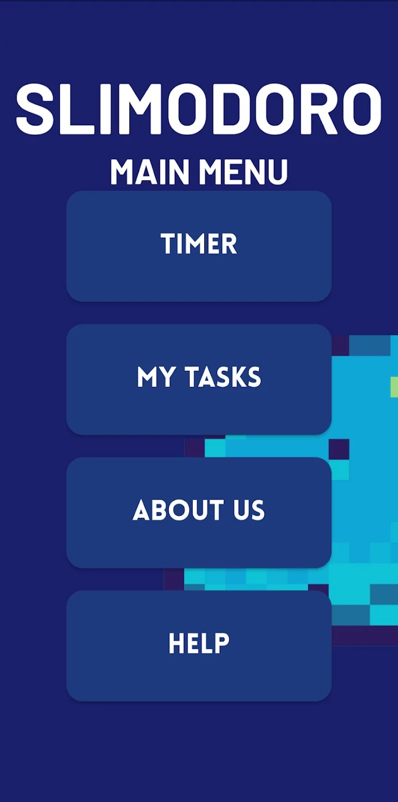
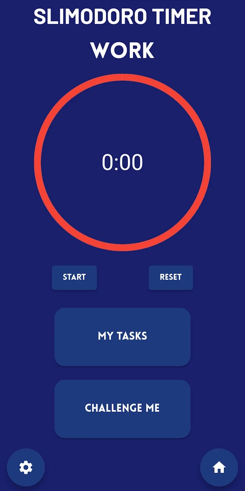
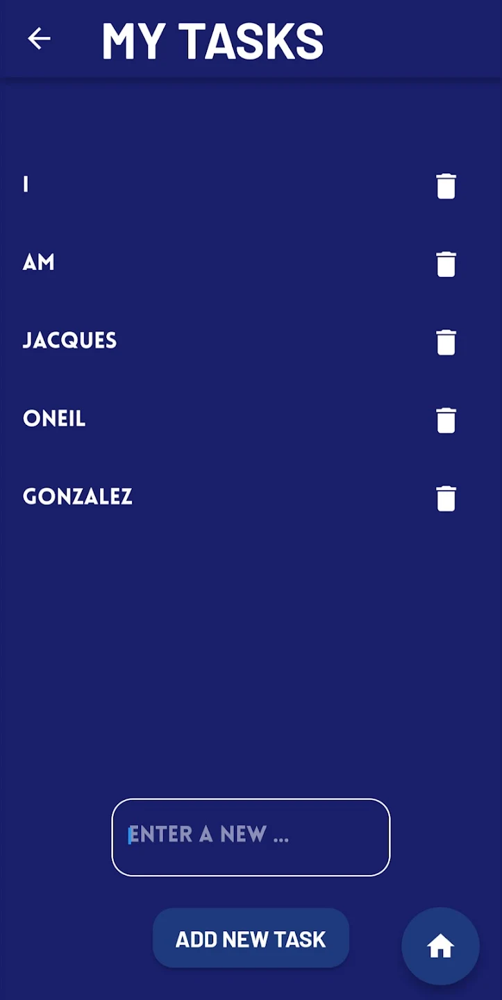

# List Of Published Mobile Applications
# 1. Slimodoro

## Link
https://play.google.com/store/apps/details?id=com.application.slimodoro
Slimodoro is a mobile Pomodoro timer app built with Flutter, helping you stay focused and productive.

## Features

- Pomodoro Timer: Customizable work and break intervals.
- My Tasks: Manually assign and delete tasks.
- Challenge Me: Motivational timed work sessions.
- Settings: Adjustable long break intervals.
- Help Me: Overview of the app's features.

## Screenshots

    
    
    
    

